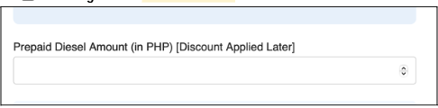
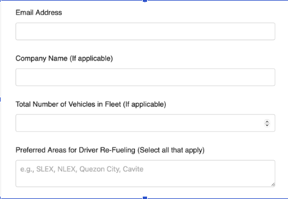

## Brief -2\

1. Create a page for viewing Customer Details → currently not visible?
   - Add new button/link onto the admin dashboard (?)
   - Customer details should include: Customer Name, Email Address, Phone Number, … [all details from the original Register Page]
   - May also include Booking transaction history per Registered Customer (table or export CSV or else)
2. Delete `/register-vehicle` page → We don’t believe this was part of the original code. This was added `/` extra?
   Only the `/register` page should exist
   - Also, swap the link on the “Register Vehicle” button on the Admin dashboard (`/admin`) from `/register-vehicle` to `/register`

3. Enable THREE fuel types for bookings across the User Flow
        - Biodiesel (“existing”)
        - Premium (NEW)
        - Unleaded (NEW)
    - Identified Sub-Changes:
        - On the Admin prices page – Add separate columns for Gasoline and Diesel prices and discounts for each fuel type. This page UI doesn’t have to be perfect `/` it will be for internal-use only.
        - Add a Fuel Type field on the `/book` form allowing users to select Gasoline or Diesel.
            - Essentially replicate the white priceXdiscount table twice, then place the three tables vertically stacked → for UX, the user can minimize 1-3 fuel tables
        - On the Admin dashboard – Add a fuel type column (Biodiesel, Premium, Unleaded).
        - On the Supplier PDF export – Add a fuel type column (Biodiesel, Premium Gasoline, or Unleaded Gasoline).
        - Booking form – remove “Diesel” in this field
        

4. On the /register page
    - Make the last four fields optional.
    - For all four fields, add "(Optional)" beside each field label.
    
    ```
    Note: Remove existing labels in parentheses (If applicable, Select all that apply) /// Replace the helper text (if applicable) and (select all that apply) with "(Optional)" for consistency.
    ```
5. Provide instructions or documentation on how to add or remove Stations from the backend/database for future management. Or do we need a page / dashboard for this?